# 参考资料

* [《Flask官方文档》](http://flask.pocoo.org/)
* [《深入理解 Flask》](https://book.douban.com/subject/26838547/)
* [《Flask Web开发：基于Python的Web应用开发实战》](https://book.douban.com/subject/26274202/)

# 开发环境与工具

* 开发环境：Ubuntu 16.04
* 开发工具：PyCharm 2017.3.4
* 开发语言：Python 3.5.2
* 后端框架：Flask 0.12.2
* 前端框架：Bootstrap 3.3.7

# 模块划分

* admin：用于管理Admin页面
* api_1_0：实现的Restful API
* auth：用于用户注册、登录、发送邮件和更改设置
* main：网站的主要功能，如主页、写博客、关注人等

# 下载依赖包

建议新建一个虚拟环境，然后使用如下命令下载依赖包

```
pip install -r requirements.txt
```

# 运行

首先进入虚拟环境，导入 `app.py` 环境变量

```
export FLASK_APP=app.py
```

然后使用如下命令运行

```
flask run
```

# 出现问题

由于为了不用下载插件，所以直接将虚拟环境上传了。

如果出现文件找不到，插件找不到，或者Python版本不对等等问题时，将 `venv/bin/` 下文件中的路径修改为恰当路径，比如：

1. 将 `venv/bin/activate` 文件中的 `VIRTUAL_ENV` 修改为自己当前的正确路径
2. 将 `venv/bin/flask` 文件中第一行的 Python 执行路径修改为自己的正确路径
3. 等等

# 网站截图

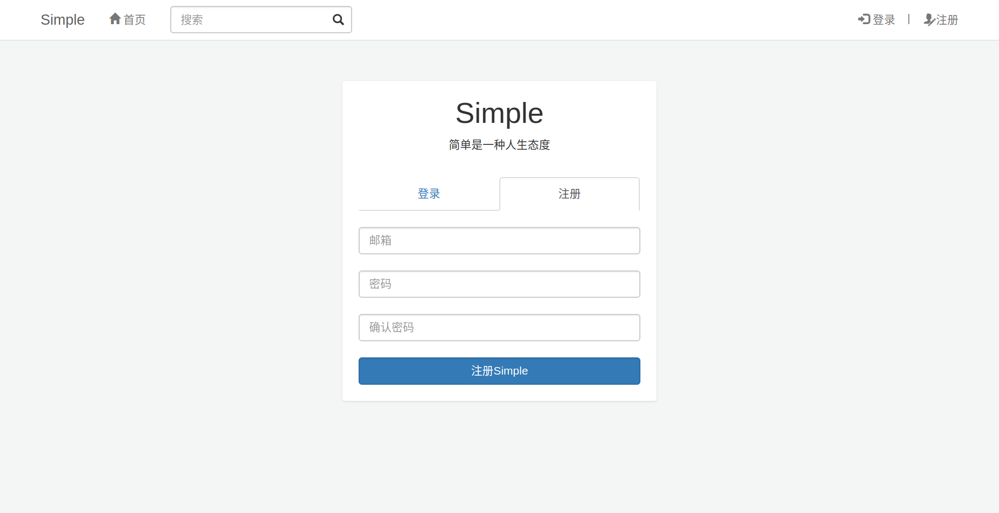

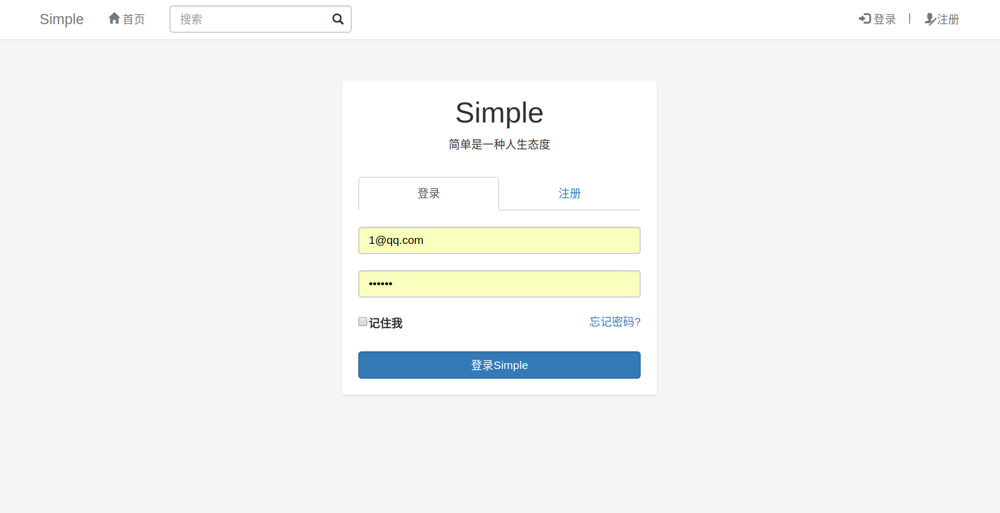

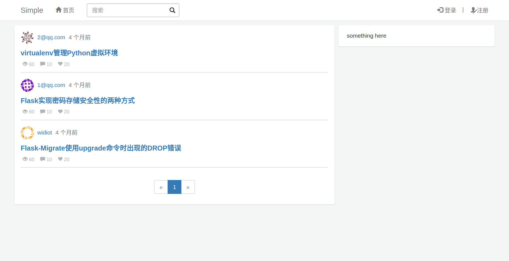

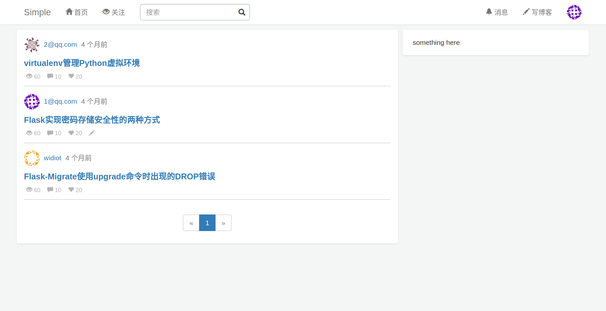

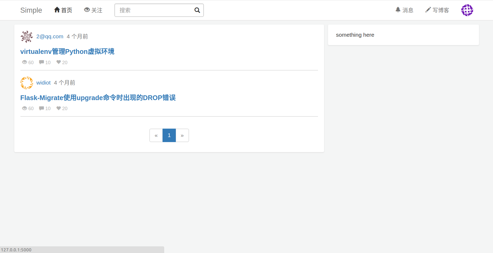

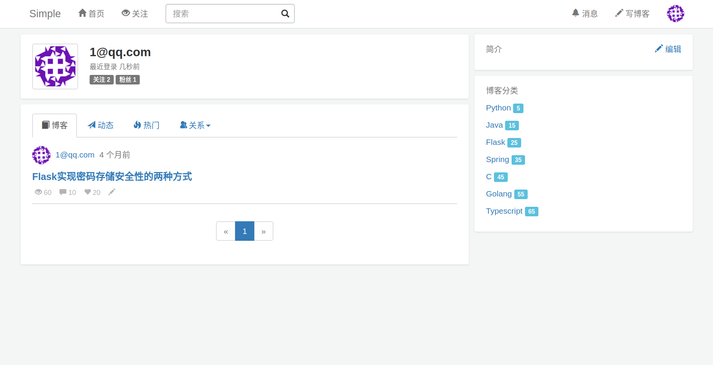

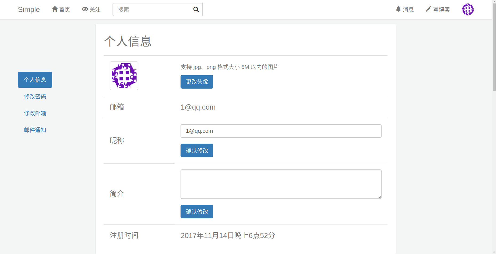

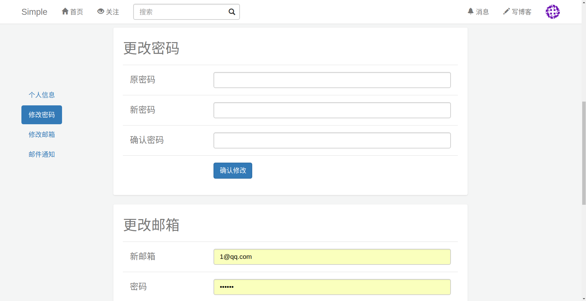

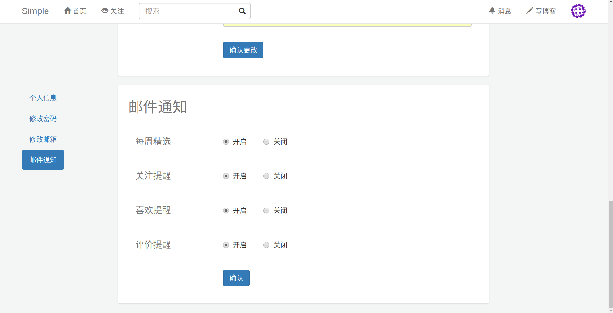

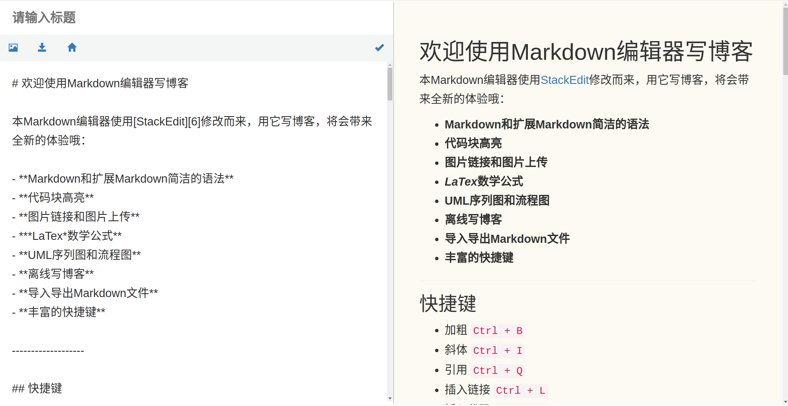

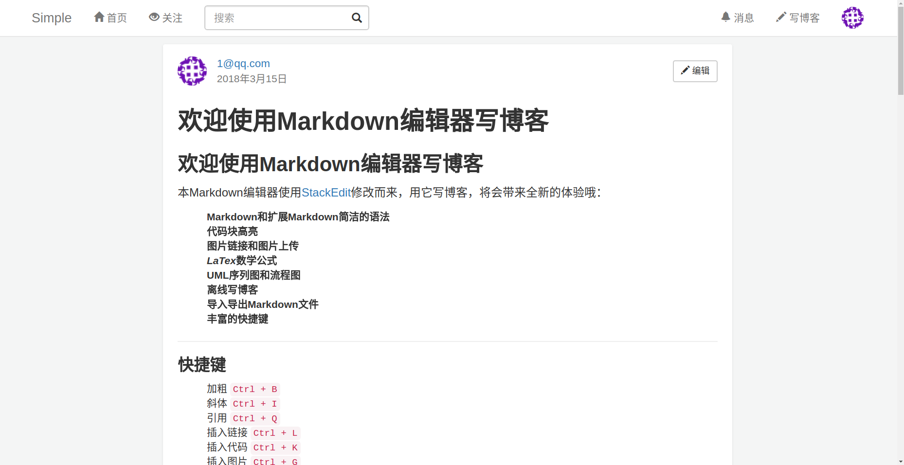

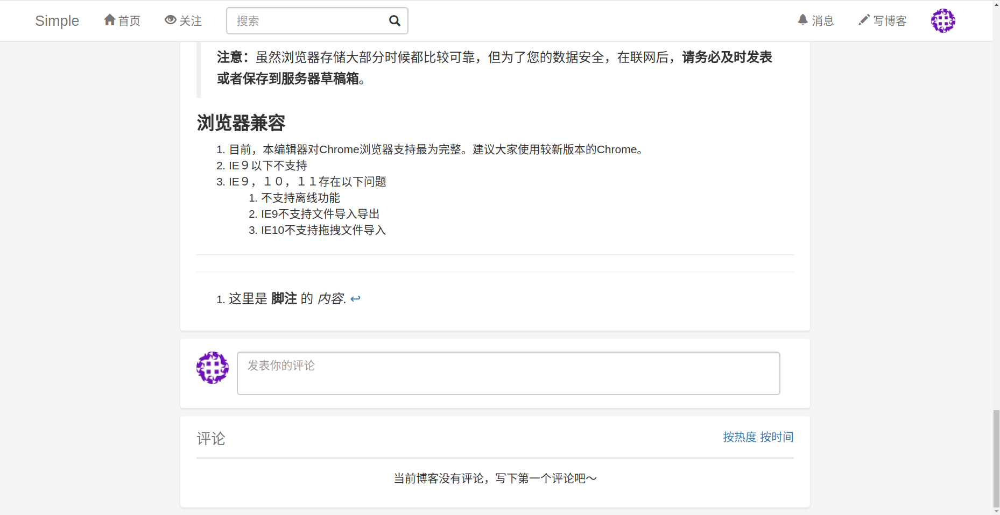

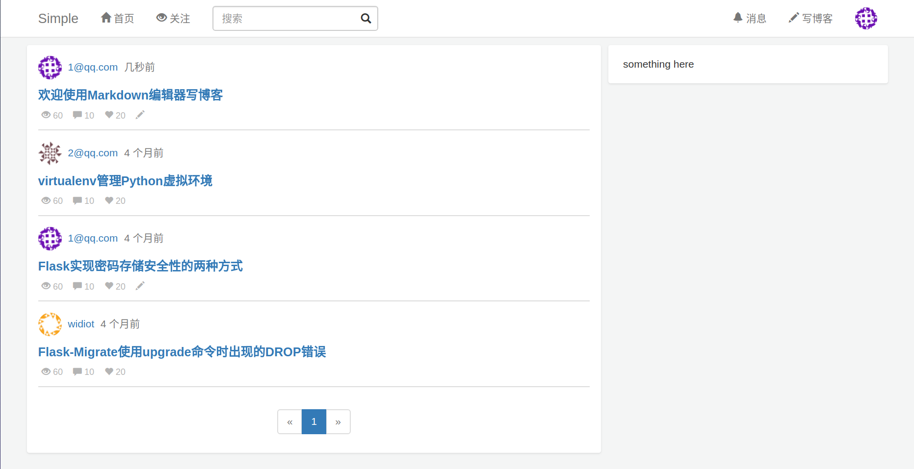

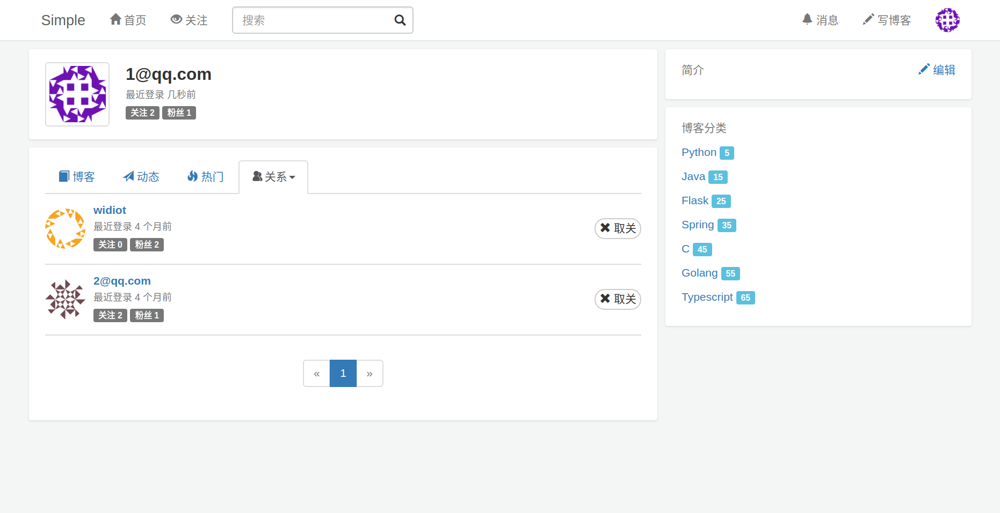

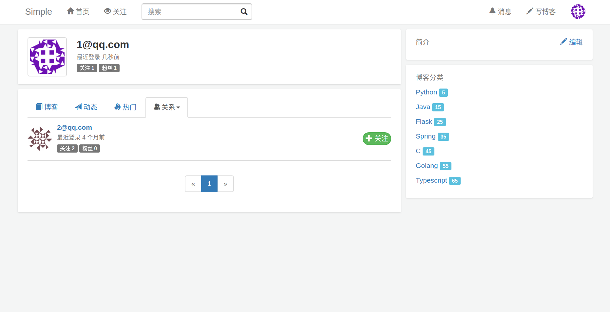

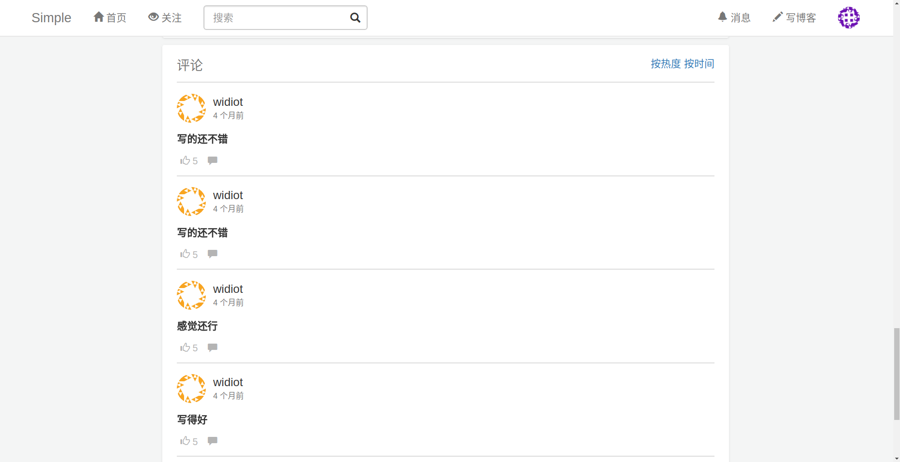